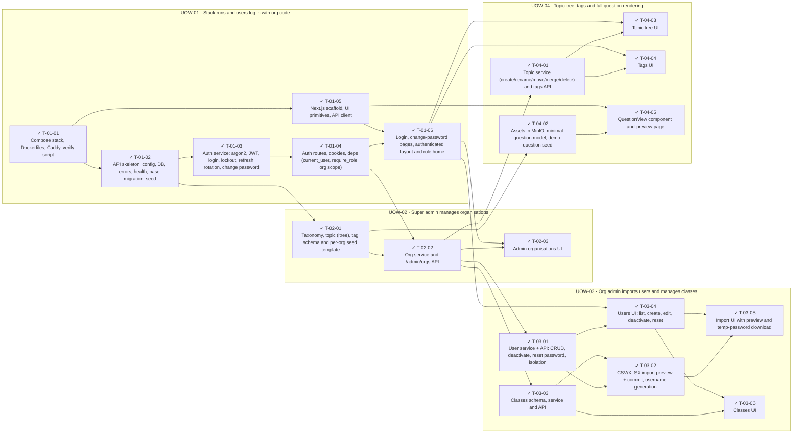

<!-- GENERATED by scripts/uow_graph.py — do not edit by hand -->

# Ticket graph — 2026092101-platform-foundation

- Units of Work: **4**
- Tickets: **20** (20 done)
- Total effort: **8.6d**
- Critical path: **3.5d** across 8 tickets
- Theoretical minimum duration with unlimited parallelism: **3.5d**

## Units of Work

| UoW | Title | Risk | Effort | Elapsed | Depends on | Status |
|-----|-------|------|--------|---------|-----------|--------|
| UOW-01 | Stack runs and users log in with org code | high | 2.4d | 2.0d | — | todo |
| UOW-02 | Super admin manages organisations | medium | 1.5d | 1.5d | UOW-01 | todo |
| UOW-03 | Org admin imports users and manages classes | medium | 2.6d | 1.4d | UOW-02 | todo |
| UOW-04 | Topic tree, tags and full question rendering | medium | 2.1d | 1.0d | UOW-02 | todo |

Effort is total person-hours. Elapsed is the longest dependency chain inside the
slice — the floor on how fast it can finish no matter how many people work on it.

## Dependency graph

## Execution waves

Tickets in the same wave have no dependency between them and can run in parallel.

| Wave | Tickets | Parallel capacity | Wave duration (longest ticket) |
|------|---------|-------------------|-------------------------------|
| W1 | T-01-01 | 1 | 3h |
| W2 | T-01-02, T-01-05 | 2 | 4h |
| W3 | T-01-03, T-02-01 | 2 | 4h |
| W4 | T-01-04, T-04-02 | 2 | 3h |
| W5 | T-01-06, T-02-02, T-04-05 | 3 | 4h |
| W6 | T-02-03, T-03-01, T-03-03, T-04-01 | 4 | 4h |
| W7 | T-03-02, T-03-04, T-04-03, T-04-04 | 4 | 4h |
| W8 | T-03-05, T-03-06 | 2 | 3h |

## Write-conflict hazards

None: every pair that writes a shared path is ordered by a dependency.

## Critical path

T-01-01 → T-01-02 → T-01-03 → T-01-04 → T-02-02 → T-03-01 → T-03-02 → T-03-05

Total: **3.5d**. Shortening the plan means shortening this chain;
adding people to tickets off this path will not make the feature ship sooner.

## Tickets

| ID | UoW | Layer | Type | Est | Depends on | Verifies | Status |
|----|-----|-------|------|-----|-----------|----------|--------|
| T-01-01 | UOW-01 | infra | chore | 3h | — | AC-01 | done |
| T-01-02 | UOW-01 | data | feature | 4h | T-01-01 | AC-01, AC-02 | done |
| T-01-03 | UOW-01 | domain | feature | 3h | T-01-02 | AC-03, AC-04, AC-05, AC-06, AC-08, AC-09 | done |
| T-01-04 | UOW-01 | api | feature | 3h | T-01-03 | AC-03, AC-04, AC-05, AC-06, AC-08, AC-09 | done |
| T-01-05 | UOW-01 | web | chore | 3h | T-01-01 | AC-08 | done |
| T-01-06 | UOW-01 | web | feature | 3h | T-01-04, T-01-05 | AC-03, AC-04, AC-07, AC-09 | done |
| T-02-01 | UOW-02 | data | feature | 4h | T-01-02 | AC-10 | done |
| T-02-02 | UOW-02 | api | feature | 4h | T-02-01, T-01-04 | AC-10, AC-11, AC-12, AC-13, AC-14 | done |
| T-02-03 | UOW-02 | web | feature | 4h | T-02-02, T-01-06 | AC-10, AC-11, AC-12, AC-13 | done |
| T-03-01 | UOW-03 | api | feature | 4h | T-02-02 | AC-15, AC-18, AC-19 | done |
| T-03-02 | UOW-03 | domain | feature | 4h | T-03-01, T-03-03 | AC-16, AC-17 | done |
| T-03-03 | UOW-03 | api | feature | 3h | T-02-02 | AC-19, AC-20 | done |
| T-03-04 | UOW-03 | web | feature | 4h | T-03-01, T-01-06 | AC-15, AC-18 | done |
| T-03-05 | UOW-03 | web | feature | 3h | T-03-02, T-03-04 | AC-16, AC-17 | done |
| T-03-06 | UOW-03 | web | feature | 3h | T-03-03, T-03-04 | AC-20 | done |
| T-04-01 | UOW-04 | api | feature | 4h | T-02-02 | AC-21, AC-22, AC-23 | done |
| T-04-02 | UOW-04 | data | feature | 3h | T-02-01 | AC-24 | done |
| T-04-03 | UOW-04 | web | feature | 4h | T-04-01, T-01-06 | AC-21, AC-22 | done |
| T-04-04 | UOW-04 | web | feature | 2h | T-04-01, T-01-06 | AC-23 | done |
| T-04-05 | UOW-04 | web | feature | 4h | T-04-02, T-01-05 | AC-24 | done |
