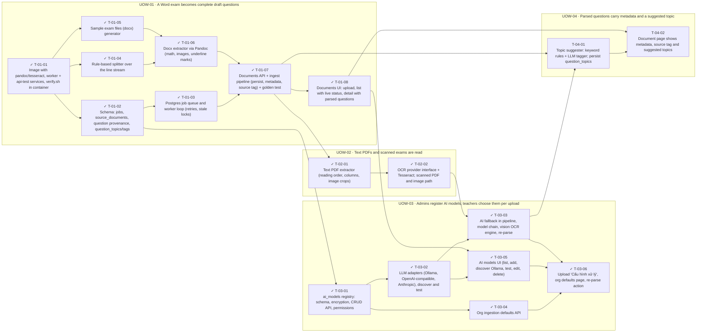

<!-- GENERATED by scripts/uow_graph.py — do not edit by hand -->

# Ticket graph — 2026092201-exam-ingestion

- Units of Work: **4**
- Tickets: **18** (16 done)
- Total effort: **7.4d**
- Critical path: **3.9d** across 9 tickets
- Theoretical minimum duration with unlimited parallelism: **3.9d**

## Units of Work

| UoW | Title | Risk | Effort | Elapsed | Depends on | Status |
|-----|-------|------|--------|---------|-----------|--------|
| UOW-01 | A Word exam becomes complete draft questions | high | 2.9d | 2.0d | — | todo |
| UOW-02 | Text PDFs and scanned exams are read | medium | 1.0d | 1.0d | UOW-01 | todo |
| UOW-03 | Admins register AI models; teachers choose them per upload | medium | 2.8d | 2.0d | UOW-01 | todo |
| UOW-04 | Parsed questions carry metadata and a suggested topic | medium | 6h | 6h | UOW-01 | todo |

Effort is total person-hours. Elapsed is the longest dependency chain inside the
slice — the floor on how fast it can finish no matter how many people work on it.

## Dependency graph

## Execution waves

Tickets in the same wave have no dependency between them and can run in parallel.

| Wave | Tickets | Parallel capacity | Wave duration (longest ticket) |
|------|---------|-------------------|-------------------------------|
| W1 | T-01-01 | 1 | 2h |
| W2 | T-01-02, T-01-04, T-01-05 | 3 | 4h |
| W3 | T-01-03, T-01-06, T-03-01 | 3 | 4h |
| W4 | T-01-07, T-03-02, T-03-04 | 3 | 4h |
| W5 | T-01-08, T-02-01 | 2 | 4h |
| W6 | T-02-02, T-03-05 | 2 | 4h |
| W7 | T-03-03 | 1 | 4h |
| W8 | T-03-06, T-04-01 | 2 | 4h |
| W9 | T-04-02 | 1 | 2h |

## Write-conflict hazards

These pairs have no ordering constraint, so a scheduler may run them at the
same time — and they write the same path. Sequential execution is safe;
parallel agents will lose one side's work.

| A | B | Contested path |
|---|---|---|
| T-01-07 | T-03-04 | `apps/api/app/services/ingestion_settings.py` |

## Critical path

T-01-01 → T-01-04 → T-01-06 → T-01-07 → T-02-01 → T-02-02 → T-03-03 → T-04-01 → T-04-02

Total: **3.9d**. Shortening the plan means shortening this chain;
adding people to tickets off this path will not make the feature ship sooner.

## Tickets

| ID | UoW | Layer | Type | Est | Depends on | Verifies | Status |
|----|-----|-------|------|-----|-----------|----------|--------|
| T-01-01 | UOW-01 | infra | chore | 2h | — | AC-01 | done |
| T-01-02 | UOW-01 | data | feature | 3h | T-01-01 | AC-01, AC-21 | done |
| T-01-03 | UOW-01 | worker | feature | 2h | T-01-02 | AC-04 | done |
| T-01-04 | UOW-01 | domain | feature | 4h | T-01-01 | AC-05, AC-07, AC-08, AC-09, AC-10 | done |
| T-01-05 | UOW-01 | test | test | 2h | T-01-01 | AC-05, AC-06, AC-09 | done |
| T-01-06 | UOW-01 | worker | feature | 3h | T-01-04, T-01-05 | AC-06, AC-07 | done |
| T-01-07 | UOW-01 | api | feature | 4h | T-01-03, T-01-06 | AC-01, AC-02, AC-03, AC-21 | done |
| T-01-08 | UOW-01 | web | feature | 3h | T-01-07 | AC-01, AC-02, AC-03 | done |
| T-02-01 | UOW-02 | worker | feature | 4h | T-01-07 | AC-11 | done |
| T-02-02 | UOW-02 | worker | feature | 4h | T-02-01 | AC-12 | done |
| T-03-01 | UOW-03 | api | feature | 4h | T-01-02 | AC-13, AC-15 | done |
| T-03-02 | UOW-03 | worker | feature | 4h | T-03-01 | AC-14 | done |
| T-03-03 | UOW-03 | worker | feature | 4h | T-03-02, T-02-02 | AC-16, AC-18, AC-19, AC-20 | done |
| T-03-04 | UOW-03 | api | feature | 2h | T-03-01 | AC-17 | done |
| T-03-05 | UOW-03 | web | feature | 4h | T-03-02, T-01-08 | AC-13, AC-14, AC-15 | done |
| T-03-06 | UOW-03 | web | feature | 4h | T-03-04, T-03-05, T-03-03 | AC-16, AC-17, AC-20 | done |
| T-04-01 | UOW-04 | domain | feature | 4h | T-01-07, T-03-03 | AC-22 | todo |
| T-04-02 | UOW-04 | web | feature | 2h | T-04-01, T-01-08 | AC-21, AC-22 | todo |
