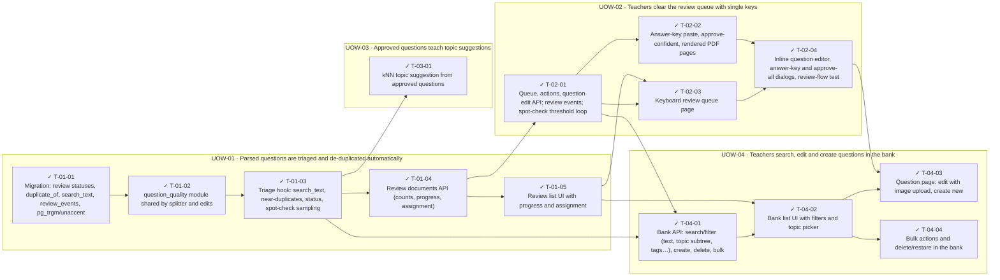

<!-- GENERATED by scripts/uow_graph.py — do not edit by hand -->

# Ticket graph — 2026092202-question-review

- Units of Work: **4**
- Tickets: **14** (14 done)
- Total effort: **6.1d**
- Critical path: **3.6d** across 8 tickets
- Theoretical minimum duration with unlimited parallelism: **3.6d**

## Units of Work

| UoW | Title | Risk | Effort | Elapsed | Depends on | Status |
|-----|-------|------|--------|---------|-----------|--------|
| UOW-01 | Parsed questions are triaged and de-duplicated automatically | medium | 2.0d | 2.0d | — | todo |
| UOW-02 | Teachers clear the review queue with single keys | high | 1.9d | 1.5d | UOW-01 | todo |
| UOW-03 | Approved questions teach topic suggestions | medium | 3h | 3h | UOW-01 | todo |
| UOW-04 | Teachers search, edit and create questions in the bank | medium | 1.9d | 1.5d | UOW-01 | todo |

Effort is total person-hours. Elapsed is the longest dependency chain inside the
slice — the floor on how fast it can finish no matter how many people work on it.

## Dependency graph

## Execution waves

Tickets in the same wave have no dependency between them and can run in parallel.

| Wave | Tickets | Parallel capacity | Wave duration (longest ticket) |
|------|---------|-------------------|-------------------------------|
| W1 | T-01-01 | 1 | 3h |
| W2 | T-01-02 | 1 | 3h |
| W3 | T-01-03 | 1 | 4h |
| W4 | T-01-04, T-03-01 | 2 | 3h |
| W5 | T-01-05, T-02-01 | 2 | 4h |
| W6 | T-02-02, T-02-03, T-04-01 | 3 | 4h |
| W7 | T-02-04, T-04-02 | 2 | 4h |
| W8 | T-04-03, T-04-04 | 2 | 4h |

## Write-conflict hazards

These pairs have no ordering constraint, so a scheduler may run them at the
same time — and they write the same path. Sequential execution is safe;
parallel agents will lose one side's work.

| A | B | Contested path |
|---|---|---|
| T-02-03 | T-04-02 | `apps/web/src/components/bank/TopicPicker.tsx` |

## Critical path

T-01-01 → T-01-02 → T-01-03 → T-01-04 → T-02-01 → T-04-01 → T-04-02 → T-04-03

Total: **3.6d**. Shortening the plan means shortening this chain;
adding people to tickets off this path will not make the feature ship sooner.

## Tickets

| ID | UoW | Layer | Type | Est | Depends on | Verifies | Status |
|----|-----|-------|------|-----|-----------|----------|--------|
| T-01-01 | UOW-01 | data | feature | 3h | — | AC-01, AC-03, AC-13, AC-14 | done |
| T-01-02 | UOW-01 | domain | feature | 3h | T-01-01 | AC-01, AC-07 | done |
| T-01-03 | UOW-01 | worker | feature | 4h | T-01-02 | AC-01, AC-03, AC-11 | done |
| T-01-04 | UOW-01 | api | feature | 3h | T-01-03 | AC-02, AC-14, AC-20 | done |
| T-01-05 | UOW-01 | web | feature | 3h | T-01-04 | AC-02, AC-14 | done |
| T-02-01 | UOW-02 | api | feature | 4h | T-01-04 | AC-04, AC-05, AC-07, AC-11, AC-13 | done |
| T-02-02 | UOW-02 | api | feature | 3h | T-02-01 | AC-04, AC-08, AC-09 | done |
| T-02-03 | UOW-02 | web | feature | 4h | T-02-01, T-01-05 | AC-04, AC-05, AC-06 | done |
| T-02-04 | UOW-02 | web | feature | 4h | T-02-03, T-02-02 | AC-07, AC-08, AC-09 | done |
| T-03-01 | UOW-03 | worker | feature | 3h | T-01-03 | AC-12 | done |
| T-04-01 | UOW-04 | api | feature | 4h | T-01-03, T-02-01 | AC-10, AC-15, AC-16, AC-18, AC-19, AC-20 | done |
| T-04-02 | UOW-04 | web | feature | 4h | T-04-01, T-01-05 | AC-15, AC-16 | done |
| T-04-03 | UOW-04 | web | feature | 4h | T-04-02, T-02-04 | AC-17, AC-18 | done |
| T-04-04 | UOW-04 | web | feature | 3h | T-04-02 | AC-10, AC-19 | done |
