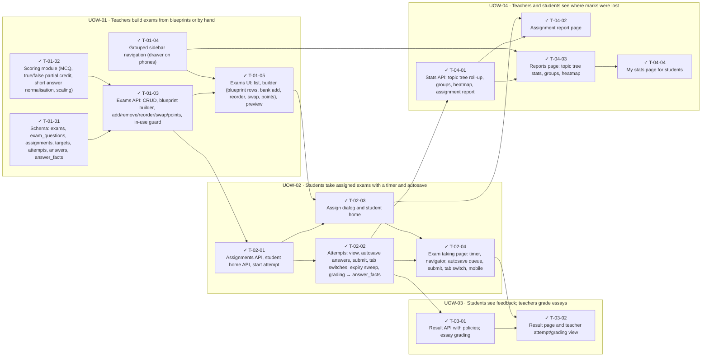

<!-- GENERATED by scripts/uow_graph.py — do not edit by hand -->

# Ticket graph — 2026092203-exam-practice

- Units of Work: **4**
- Tickets: **15** (15 done)
- Total effort: **6.5d**
- Critical path: **3.1d** across 7 tickets
- Theoretical minimum duration with unlimited parallelism: **3.1d**

## Units of Work

| UoW | Title | Risk | Effort | Elapsed | Depends on | Status |
|-----|-------|------|--------|---------|-----------|--------|
| UOW-01 | Teachers build exams from blueprints or by hand | medium | 2.1d | 1.4d | — | todo |
| UOW-02 | Students take assigned exams with a timer and autosave | high | 1.9d | 1.5d | UOW-01 | todo |
| UOW-03 | Students see feedback; teachers grade essays | medium | 7h | 7h | UOW-02 | todo |
| UOW-04 | Teachers and students see where marks were lost | medium | 1.6d | 1.2d | UOW-02 | todo |

Effort is total person-hours. Elapsed is the longest dependency chain inside the
slice — the floor on how fast it can finish no matter how many people work on it.

## Dependency graph

## Execution waves

Tickets in the same wave have no dependency between them and can run in parallel.

| Wave | Tickets | Parallel capacity | Wave duration (longest ticket) |
|------|---------|-------------------|-------------------------------|
| W1 | T-01-01, T-01-02, T-01-04 | 3 | 3h |
| W2 | T-01-03 | 1 | 4h |
| W3 | T-01-05, T-02-01 | 2 | 4h |
| W4 | T-02-02, T-02-03 | 2 | 4h |
| W5 | T-02-04, T-03-01, T-04-01 | 3 | 4h |
| W6 | T-03-02, T-04-02, T-04-03 | 3 | 4h |
| W7 | T-04-04 | 1 | 2h |

## Write-conflict hazards

None: every pair that writes a shared path is ordered by a dependency.

## Critical path

T-01-01 → T-01-03 → T-02-01 → T-02-02 → T-04-01 → T-04-03 → T-04-04

Total: **3.1d**. Shortening the plan means shortening this chain;
adding people to tickets off this path will not make the feature ship sooner.

## Tickets

| ID | UoW | Layer | Type | Est | Depends on | Verifies | Status |
|----|-----|-------|------|-----|-----------|----------|--------|
| T-01-01 | UOW-01 | data | feature | 3h | — | AC-01, AC-05, AC-07, AC-17 | done |
| T-01-02 | UOW-01 | domain | feature | 3h | — | AC-03, AC-11 | done |
| T-01-03 | UOW-01 | api | feature | 4h | T-01-01, T-01-02 | AC-01, AC-02, AC-03, AC-15 | done |
| T-01-04 | UOW-01 | web | feature | 3h | — | AC-22 | done |
| T-01-05 | UOW-01 | web | feature | 4h | T-01-03, T-01-04 | AC-01, AC-02, AC-03, AC-04 | done |
| T-02-01 | UOW-02 | api | feature | 4h | T-01-03 | AC-05, AC-06, AC-20 | done |
| T-02-02 | UOW-02 | api | feature | 4h | T-02-01 | AC-07, AC-08, AC-09, AC-10, AC-11, AC-15 | done |
| T-02-03 | UOW-02 | web | feature | 3h | T-02-01, T-01-05 | AC-05, AC-20 | done |
| T-02-04 | UOW-02 | web | feature | 4h | T-02-02, T-02-03 | AC-07, AC-08, AC-09, AC-10 | done |
| T-03-01 | UOW-03 | api | feature | 3h | T-02-02 | AC-12, AC-13, AC-14 | done |
| T-03-02 | UOW-03 | web | feature | 4h | T-03-01, T-02-04 | AC-12, AC-13, AC-14 | done |
| T-04-01 | UOW-04 | api | feature | 4h | T-02-02 | AC-16, AC-17, AC-18, AC-19, AC-21 | done |
| T-04-02 | UOW-04 | web | feature | 3h | T-04-01, T-02-03 | AC-16 | done |
| T-04-03 | UOW-04 | web | feature | 4h | T-04-01, T-01-04 | AC-17, AC-18, AC-19 | done |
| T-04-04 | UOW-04 | web | feature | 2h | T-04-03 | AC-21 | done |
