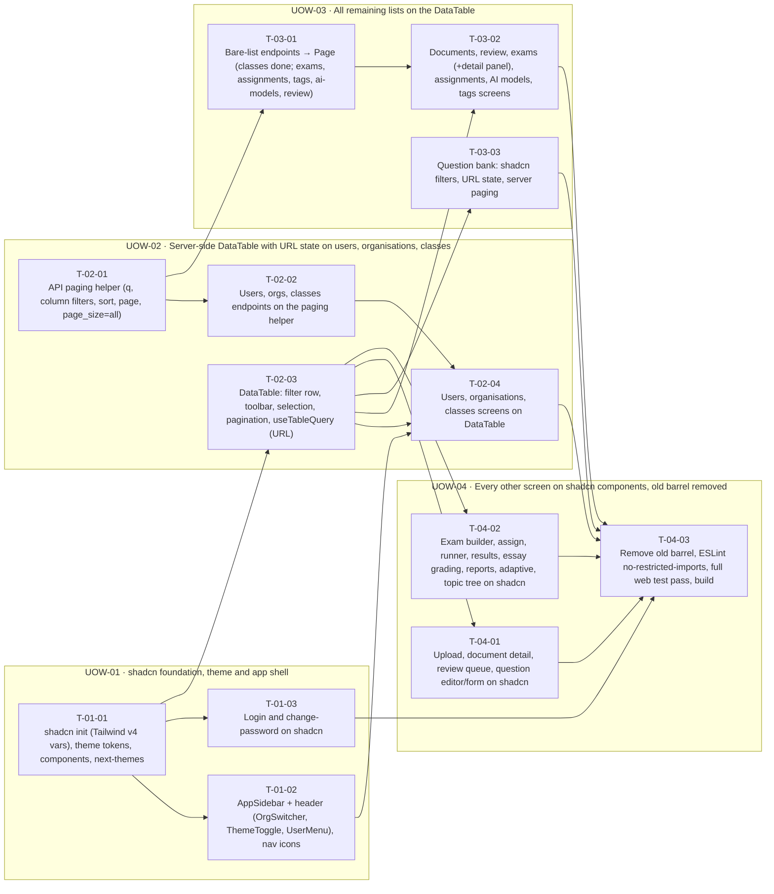

<!-- GENERATED by scripts/uow_graph.py — do not edit by hand -->

# Ticket graph — 2026092205-ui-shadcn-shell

- Units of Work: **4**
- Tickets: **13** (0 done)
- Total effort: **5.2d**
- Critical path: **1.6d** across 4 tickets
- Theoretical minimum duration with unlimited parallelism: **1.6d**

## Units of Work

| UoW | Title | Risk | Effort | Elapsed | Depends on | Status |
|-----|-------|------|--------|---------|-----------|--------|
| UOW-01 | shadcn foundation, theme and app shell | medium | 1.0d | 7h | — | todo |
| UOW-02 | Server-side DataTable with URL state on users, organisations, classes | high | 1.8d | 1.2d | UOW-01 | todo |
| UOW-03 | All remaining lists on the DataTable | medium | 1.2d | 7h | UOW-02 | todo |
| UOW-04 | Every other screen on shadcn components, old barrel removed | medium | 1.2d | 6h | UOW-02 | todo |

Effort is total person-hours. Elapsed is the longest dependency chain inside the
slice — the floor on how fast it can finish no matter how many people work on it.

## Dependency graph

## Execution waves

Tickets in the same wave have no dependency between them and can run in parallel.

| Wave | Tickets | Parallel capacity | Wave duration (longest ticket) |
|------|---------|-------------------|-------------------------------|
| W1 | T-01-01, T-02-01 | 2 | 3h |
| W2 | T-01-02, T-01-03, T-02-02, T-02-03, T-03-01 | 5 | 4h |
| W3 | T-02-04, T-03-02, T-03-03, T-04-01, T-04-02 | 5 | 4h |
| W4 | T-04-03 | 1 | 2h |

## Write-conflict hazards

None: every pair that writes a shared path is ordered by a dependency.

## Critical path

T-01-01 → T-02-03 → T-04-01 → T-04-03

Total: **1.6d**. Shortening the plan means shortening this chain;
adding people to tickets off this path will not make the feature ship sooner.

## Tickets

| ID | UoW | Layer | Type | Est | Depends on | Verifies | Status |
|----|-----|-------|------|-----|-----------|----------|--------|
| T-01-01 | UOW-01 | web | feature | 3h | — | AC-01, AC-02 | todo |
| T-01-02 | UOW-01 | web | feature | 4h | T-01-01 | AC-03, AC-04, AC-05 | todo |
| T-01-03 | UOW-01 | web | feature | 1h | T-01-01 | AC-01 | todo |
| T-02-01 | UOW-02 | api | feature | 3h | — | AC-10 | todo |
| T-02-02 | UOW-02 | api | feature | 3h | T-02-01 | AC-10 | todo |
| T-02-03 | UOW-02 | web | feature | 4h | T-01-01 | AC-06, AC-07, AC-08, AC-09 | todo |
| T-02-04 | UOW-02 | web | feature | 4h | T-02-02, T-02-03, T-01-02 | AC-11 | todo |
| T-03-01 | UOW-03 | api | feature | 3h | T-02-01 | AC-10 | todo |
| T-03-02 | UOW-03 | web | feature | 4h | T-03-01, T-02-03 | AC-11 | todo |
| T-03-03 | UOW-03 | web | feature | 3h | T-02-03 | AC-11, AC-08 | todo |
| T-04-01 | UOW-04 | web | feature | 4h | T-02-03 | AC-12 | todo |
| T-04-02 | UOW-04 | web | feature | 4h | T-02-03 | AC-12 | todo |
| T-04-03 | UOW-04 | test | feature | 2h | T-04-01, T-04-02, T-03-02, T-03-03, T-02-04, T-01-03 | AC-01, AC-12 | todo |
