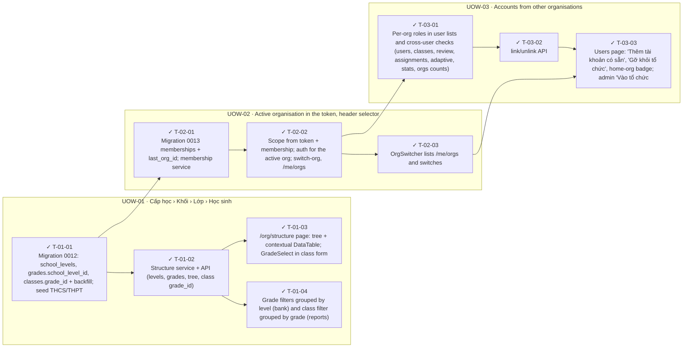

<!-- GENERATED by scripts/uow_graph.py — do not edit by hand -->

# Ticket graph — 2026092206-school-structure-multi-org

- Units of Work: **3**
- Tickets: **10** (10 done)
- Total effort: **3.8d**
- Critical path: **2.2d** across 6 tickets
- Theoretical minimum duration with unlimited parallelism: **2.2d**

## Units of Work

| UoW | Title | Risk | Effort | Elapsed | Depends on | Status |
|-----|-------|------|--------|---------|-----------|--------|
| UOW-01 | Cấp học › Khối › Lớp › Học sinh | medium | 1.6d | 1.4d | — | todo |
| UOW-02 | Active organisation in the token, header selector | high | 1.0d | 1.0d | UOW-01 | todo |
| UOW-03 | Accounts from other organisations | high | 1.1d | 1.1d | UOW-02 | todo |

Effort is total person-hours. Elapsed is the longest dependency chain inside the
slice — the floor on how fast it can finish no matter how many people work on it.

## Dependency graph

## Execution waves

Tickets in the same wave have no dependency between them and can run in parallel.

| Wave | Tickets | Parallel capacity | Wave duration (longest ticket) |
|------|---------|-------------------|-------------------------------|
| W1 | T-01-01 | 1 | 3h |
| W2 | T-01-02, T-02-01 | 2 | 4h |
| W3 | T-01-03, T-01-04, T-02-02 | 3 | 4h |
| W4 | T-02-03, T-03-01 | 2 | 4h |
| W5 | T-03-02 | 1 | 2h |
| W6 | T-03-03 | 1 | 3h |

## Write-conflict hazards

These pairs have no ordering constraint, so a scheduler may run them at the
same time — and they write the same path. Sequential execution is safe;
parallel agents will lose one side's work.

| A | B | Contested path |
|---|---|---|
| T-01-02 | T-03-01 | `apps/api/app/services/classes.py` |

## Critical path

T-01-01 → T-02-01 → T-02-02 → T-03-01 → T-03-02 → T-03-03

Total: **2.2d**. Shortening the plan means shortening this chain;
adding people to tickets off this path will not make the feature ship sooner.

## Tickets

| ID | UoW | Layer | Type | Est | Depends on | Verifies | Status |
|----|-----|-------|------|-----|-----------|----------|--------|
| T-01-01 | UOW-01 | data | feature | 3h | — | AC-01, AC-03 | done |
| T-01-02 | UOW-01 | api | feature | 4h | T-01-01 | AC-02, AC-04, AC-06 | done |
| T-01-03 | UOW-01 | web | feature | 4h | T-01-02 | AC-04, AC-05, AC-06 | done |
| T-01-04 | UOW-01 | web | feature | 2h | T-01-02 | AC-06 | done |
| T-02-01 | UOW-02 | data | feature | 2h | T-01-01 | AC-08 | done |
| T-02-02 | UOW-02 | api | feature | 4h | T-02-01 | AC-07, AC-08, AC-09, AC-10 | done |
| T-02-03 | UOW-02 | web | feature | 2h | T-02-02 | AC-07 | done |
| T-03-01 | UOW-03 | api | feature | 4h | T-02-02 | AC-13 | done |
| T-03-02 | UOW-03 | api | feature | 2h | T-03-01 | AC-11, AC-12 | done |
| T-03-03 | UOW-03 | web | feature | 3h | T-03-02, T-02-03 | AC-11, AC-12 | done |
