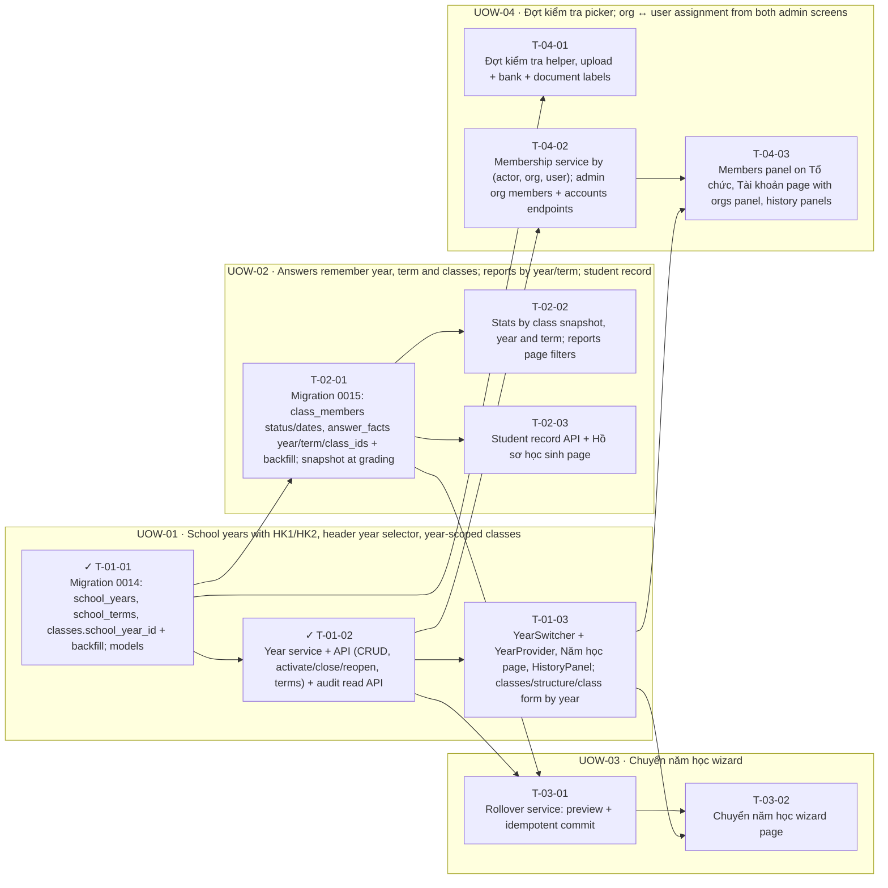

<!-- GENERATED by scripts/uow_graph.py — do not edit by hand -->

# Ticket graph — 2026092207-school-years

- Units of Work: **4**
- Tickets: **11** (2 done)
- Total effort: **4.5d**
- Critical path: **1.8d** across 4 tickets
- Theoretical minimum duration with unlimited parallelism: **1.8d**

## Units of Work

| UoW | Title | Risk | Effort | Elapsed | Depends on | Status |
|-----|-------|------|--------|---------|-----------|--------|
| UOW-01 | School years with HK1/HK2, header year selector, year-scoped classes | medium | 1.2d | 1.2d | — | todo |
| UOW-02 | Answers remember year, term and classes; reports by year/term; student record | high | 1.1d | 6h | UOW-01 | todo |
| UOW-03 | Chuyển năm học wizard | high | 1.0d | 1.0d | UOW-02 | todo |
| UOW-04 | Đợt kiểm tra picker; org ↔ user assignment from both admin screens | medium | 1.1d | 7h | UOW-01 | todo |

Effort is total person-hours. Elapsed is the longest dependency chain inside the
slice — the floor on how fast it can finish no matter how many people work on it.

## Dependency graph

## Execution waves

Tickets in the same wave have no dependency between them and can run in parallel.

| Wave | Tickets | Parallel capacity | Wave duration (longest ticket) |
|------|---------|-------------------|-------------------------------|
| W1 | T-01-01 | 1 | 2h |
| W2 | T-01-02, T-02-01, T-04-01 | 3 | 4h |
| W3 | T-01-03, T-02-02, T-02-03, T-03-01, T-04-02 | 5 | 4h |
| W4 | T-03-02, T-04-03 | 2 | 4h |

## Write-conflict hazards

None: every pair that writes a shared path is ordered by a dependency.

## Critical path

T-01-01 → T-01-02 → T-03-01 → T-03-02

Total: **1.8d**. Shortening the plan means shortening this chain;
adding people to tickets off this path will not make the feature ship sooner.

## Tickets

| ID | UoW | Layer | Type | Est | Depends on | Verifies | Status |
|----|-----|-------|------|-----|-----------|----------|--------|
| T-01-01 | UOW-01 | data | feature | 2h | — | AC-02 | done |
| T-01-02 | UOW-01 | api | feature | 4h | T-01-01 | AC-01, AC-04, AC-16 | done |
| T-01-03 | UOW-01 | web | feature | 4h | T-01-02 | AC-03, AC-04 | todo |
| T-02-01 | UOW-02 | data | feature | 3h | T-01-01 | AC-05 | todo |
| T-02-02 | UOW-02 | api | feature | 3h | T-02-01 | AC-06, AC-07 | todo |
| T-02-03 | UOW-02 | web | feature | 3h | T-02-01 | AC-08 | todo |
| T-03-01 | UOW-03 | domain | feature | 4h | T-02-01, T-01-02 | AC-09, AC-10, AC-11 | todo |
| T-03-02 | UOW-03 | web | feature | 4h | T-03-01, T-01-03 | AC-09, AC-10 | todo |
| T-04-01 | UOW-04 | web | feature | 2h | T-01-01 | AC-12 | todo |
| T-04-02 | UOW-04 | api | feature | 3h | T-01-02 | AC-13, AC-14, AC-15 | todo |
| T-04-03 | UOW-04 | web | feature | 4h | T-04-02, T-01-03 | AC-13, AC-14, AC-15, AC-16 | todo |
