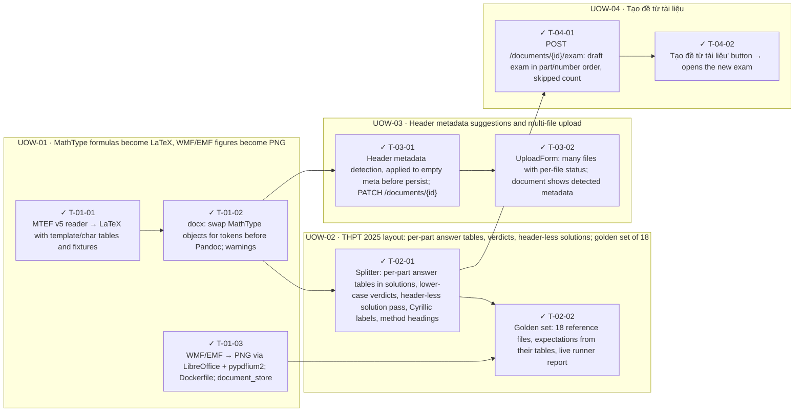

<!-- GENERATED by scripts/uow_graph.py — do not edit by hand -->

# Ticket graph — 2026092208-official-exam-ingestion

- Units of Work: **4**
- Tickets: **9** (9 done)
- Total effort: **3.2d**
- Critical path: **1.8d** across 4 tickets
- Theoretical minimum duration with unlimited parallelism: **1.8d**

## Units of Work

| UoW | Title | Risk | Effort | Elapsed | Depends on | Status |
|-----|-------|------|--------|---------|-----------|--------|
| UOW-01 | MathType formulas become LaTeX, WMF/EMF figures become PNG | high | 1.1d | 6h | — | todo |
| UOW-02 | THPT 2025 layout: per-part answer tables, verdicts, header-less solutions; golden set of 18 | high | 1.0d | 1.0d | UOW-01 | todo |
| UOW-03 | Header metadata suggestions and multi-file upload | medium | 6h | 6h | UOW-01 | todo |
| UOW-04 | Tạo đề từ tài liệu | low | 3h | 3h | UOW-02 | todo |

Effort is total person-hours. Elapsed is the longest dependency chain inside the
slice — the floor on how fast it can finish no matter how many people work on it.

## Dependency graph

## Execution waves

Tickets in the same wave have no dependency between them and can run in parallel.

| Wave | Tickets | Parallel capacity | Wave duration (longest ticket) |
|------|---------|-------------------|-------------------------------|
| W1 | T-01-01, T-01-03 | 2 | 4h |
| W2 | T-01-02 | 1 | 2h |
| W3 | T-02-01, T-03-01 | 2 | 4h |
| W4 | T-02-02, T-03-02, T-04-01 | 3 | 4h |
| W5 | T-04-02 | 1 | 1h |

## Write-conflict hazards

These pairs have no ordering constraint, so a scheduler may run them at the
same time — and they write the same path. Sequential execution is safe;
parallel agents will lose one side's work.

| A | B | Contested path |
|---|---|---|
| T-03-01 | T-04-01 | `apps/api/app/routers/documents.py` |

## Critical path

T-01-01 → T-01-02 → T-02-01 → T-02-02

Total: **1.8d**. Shortening the plan means shortening this chain;
adding people to tickets off this path will not make the feature ship sooner.

## Tickets

| ID | UoW | Layer | Type | Est | Depends on | Verifies | Status |
|----|-----|-------|------|-----|-----------|----------|--------|
| T-01-01 | UOW-01 | domain | feature | 4h | — | AC-01, AC-02 | done |
| T-01-02 | UOW-01 | domain | feature | 2h | T-01-01 | AC-01, AC-02 | done |
| T-01-03 | UOW-01 | infra | feature | 3h | — | AC-03 | done |
| T-02-01 | UOW-02 | domain | feature | 4h | T-01-02 | AC-04, AC-05, AC-06, AC-07 | done |
| T-02-02 | UOW-02 | test | feature | 4h | T-02-01, T-01-03 | AC-08 | done |
| T-03-01 | UOW-03 | api | feature | 3h | T-01-02 | AC-09 | done |
| T-03-02 | UOW-03 | web | feature | 3h | T-03-01 | AC-10, AC-09 | done |
| T-04-01 | UOW-04 | api | feature | 2h | T-02-01 | AC-11, AC-12 | done |
| T-04-02 | UOW-04 | web | feature | 1h | T-04-01 | AC-11 | done |
