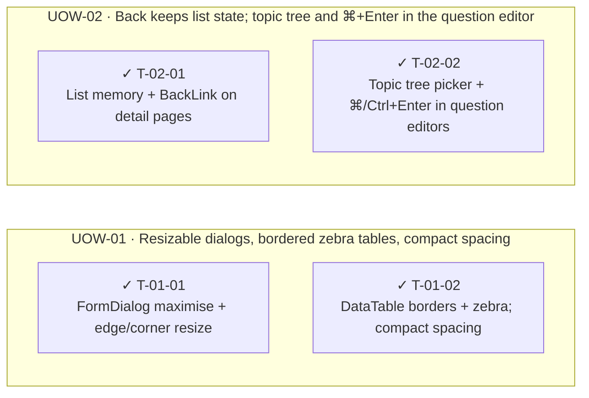

<!-- GENERATED by scripts/uow_graph.py — do not edit by hand -->

# Ticket graph — 2026092210-ui-polish-dialogs-tables

- Units of Work: **2**
- Tickets: **4** (4 done)
- Total effort: **1.2d**
- Critical path: **3h** across 1 tickets
- Theoretical minimum duration with unlimited parallelism: **3h**

## Units of Work

| UoW | Title | Risk | Effort | Elapsed | Depends on | Status |
|-----|-------|------|--------|---------|-----------|--------|
| UOW-01 | Resizable dialogs, bordered zebra tables, compact spacing | low | 5h | 3h | — | todo |
| UOW-02 | Back keeps list state; topic tree and ⌘+Enter in the question editor | low | 5h | 3h | — | todo |

Effort is total person-hours. Elapsed is the longest dependency chain inside the
slice — the floor on how fast it can finish no matter how many people work on it.

## Dependency graph

## Execution waves

Tickets in the same wave have no dependency between them and can run in parallel.

| Wave | Tickets | Parallel capacity | Wave duration (longest ticket) |
|------|---------|-------------------|-------------------------------|
| W1 | T-01-01, T-01-02, T-02-01, T-02-02 | 4 | 3h |

## Write-conflict hazards

None: every pair that writes a shared path is ordered by a dependency.

## Critical path

T-01-01

Total: **3h**. Shortening the plan means shortening this chain;
adding people to tickets off this path will not make the feature ship sooner.

## Tickets

| ID | UoW | Layer | Type | Est | Depends on | Verifies | Status |
|----|-----|-------|------|-----|-----------|----------|--------|
| T-01-01 | UOW-01 | web | feature | 3h | — | AC-01 | done |
| T-01-02 | UOW-01 | web | feature | 2h | — | AC-02, AC-06 | done |
| T-02-01 | UOW-02 | web | feature | 2h | — | AC-03 | done |
| T-02-02 | UOW-02 | web | feature | 3h | — | AC-04, AC-05 | done |
