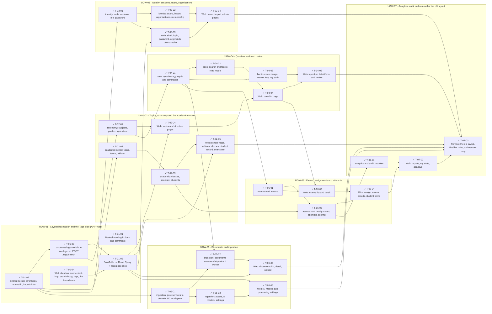

<!-- GENERATED by scripts/uow_graph.py — do not edit by hand -->

# Ticket graph — 2026092212-architecture-refactor

- Units of Work: **7**
- Tickets: **31** (31 done)
- Total effort: **13.8d**
- Critical path: **4.6d** across 10 tickets
- Theoretical minimum duration with unlimited parallelism: **4.6d**

## Units of Work

| UoW | Title | Risk | Effort | Elapsed | Depends on | Status |
|-----|-------|------|--------|---------|-----------|--------|
| UOW-01 | Layered foundation and the Tags slice (API + web) | high | 1.8d | 1.2d | — | todo |
| UOW-02 | Topics, taxonomy and the academic context | medium | 2.4d | 1.5d | — | todo |
| UOW-03 | Identity: sessions, users, organisations | high | 1.8d | 1.4d | — | todo |
| UOW-04 | Question bank and review | high | 2.5d | 2.0d | — | todo |
| UOW-05 | Documents and ingestion | high | 2.1d | 1.5d | — | todo |
| UOW-06 | Exams, assignments and attempts | high | 2.0d | 1.5d | — | todo |
| UOW-07 | Analytics, audit and removal of the old layout | medium | 1.2d | 1.2d | — | todo |

Effort is total person-hours. Elapsed is the longest dependency chain inside the
slice — the floor on how fast it can finish no matter how many people work on it.

## Dependency graph

## Execution waves

Tickets in the same wave have no dependency between them and can run in parallel.

| Wave | Tickets | Parallel capacity | Wave duration (longest ticket) |
|------|---------|-------------------|-------------------------------|
| W1 | T-01-01, T-01-02, T-01-04 | 3 | 4h |
| W2 | T-01-03, T-02-02, T-03-01, T-05-01 | 4 | 4h |
| W3 | T-01-05, T-02-01, T-02-03, T-03-02, T-05-03 | 5 | 4h |
| W4 | T-02-04, T-02-05, T-03-03, T-04-01, T-05-05 | 5 | 4h |
| W5 | T-03-04, T-04-02, T-04-03, T-05-02, T-06-01 | 5 | 4h |
| W6 | T-04-04, T-05-04, T-06-02 | 3 | 4h |
| W7 | T-04-05, T-06-03, T-07-01 | 3 | 4h |
| W8 | T-06-04 | 1 | 4h |
| W9 | T-07-02 | 1 | 3h |
| W10 | T-07-03 | 1 | 3h |

## Write-conflict hazards

These pairs have no ordering constraint, so a scheduler may run them at the
same time — and they write the same path. Sequential execution is safe;
parallel agents will lose one side's work.

| A | B | Contested path |
|---|---|---|
| T-01-01 | T-07-03 | `.ai/final-review.md` |

## Critical path

T-01-02 → T-01-03 → T-02-01 → T-04-01 → T-04-02 → T-04-04 → T-06-03 → T-06-04 → T-07-02 → T-07-03

Total: **4.6d**. Shortening the plan means shortening this chain;
adding people to tickets off this path will not make the feature ship sooner.

## Tickets

| ID | UoW | Layer | Type | Est | Depends on | Verifies | Status |
|----|-----|-------|------|-----|-----------|----------|--------|
| T-01-01 | UOW-01 | infra | feature | 1h | — | AC-08 | done |
| T-01-02 | UOW-01 | infra | feature | 4h | — | AC-01, AC-03 | done |
| T-01-03 | UOW-01 | api | feature | 3h | T-01-02 | AC-01, AC-02 | done |
| T-01-04 | UOW-01 | web | feature | 3h | — | AC-04 | done |
| T-01-05 | UOW-01 | web | feature | 3h | T-01-03, T-01-04 | AC-04, AC-05 | done |
| T-02-01 | UOW-02 | api | feature | 4h | T-01-03 | AC-01, AC-02, AC-06 | done |
| T-02-02 | UOW-02 | api | feature | 4h | T-01-02 | AC-01, AC-02, AC-06 | done |
| T-02-03 | UOW-02 | api | feature | 4h | T-02-02 | AC-01, AC-02, AC-06 | done |
| T-02-04 | UOW-02 | web | feature | 3h | T-02-01, T-01-05 | AC-04, AC-05 | done |
| T-02-05 | UOW-02 | web | feature | 4h | T-02-03, T-01-05 | AC-04, AC-05 | done |
| T-03-01 | UOW-03 | api | feature | 4h | T-01-02 | AC-01, AC-06 | done |
| T-03-02 | UOW-03 | api | feature | 4h | T-03-01 | AC-01, AC-02, AC-06 | done |
| T-03-03 | UOW-03 | web | feature | 3h | T-03-01, T-01-05 | AC-04, AC-05 | done |
| T-03-04 | UOW-03 | web | feature | 3h | T-03-02, T-03-03 | AC-04, AC-05 | done |
| T-04-01 | UOW-04 | api | feature | 4h | T-02-01 | AC-01, AC-06 | done |
| T-04-02 | UOW-04 | api | feature | 4h | T-04-01 | AC-02, AC-06 | done |
| T-04-03 | UOW-04 | api | feature | 4h | T-04-01 | AC-01, AC-06 | done |
| T-04-04 | UOW-04 | web | feature | 4h | T-04-02, T-02-04 | AC-04, AC-05 | done |
| T-04-05 | UOW-04 | web | feature | 4h | T-04-03, T-04-04 | AC-04, AC-05 | done |
| T-05-01 | UOW-05 | api | feature | 4h | T-01-02 | AC-01, AC-06 | done |
| T-05-02 | UOW-05 | api | feature | 4h | T-05-01, T-04-01 | AC-01, AC-02, AC-06 | done |
| T-05-03 | UOW-05 | api | feature | 3h | T-05-01 | AC-01, AC-02, AC-06 | done |
| T-05-04 | UOW-05 | web | feature | 4h | T-05-02, T-01-05 | AC-04, AC-05 | done |
| T-05-05 | UOW-05 | web | feature | 2h | T-05-03, T-01-05 | AC-04 | done |
| T-06-01 | UOW-06 | api | feature | 4h | T-04-01 | AC-01, AC-02, AC-06 | done |
| T-06-02 | UOW-06 | api | feature | 4h | T-06-01, T-02-03 | AC-01, AC-02, AC-06 | done |
| T-06-03 | UOW-06 | web | feature | 4h | T-06-01, T-04-04 | AC-04, AC-05 | done |
| T-06-04 | UOW-06 | web | feature | 4h | T-06-02, T-06-03 | AC-04, AC-05 | done |
| T-07-01 | UOW-07 | api | feature | 4h | T-06-02 | AC-01, AC-02, AC-06 | done |
| T-07-02 | UOW-07 | web | feature | 3h | T-07-01, T-06-04 | AC-04, AC-05 | done |
| T-07-03 | UOW-07 | infra | feature | 3h | T-07-02, T-05-04, T-05-05, T-03-04, T-02-05, T-04-05 | AC-01, AC-04, AC-06, AC-07, AC-08 | done |
