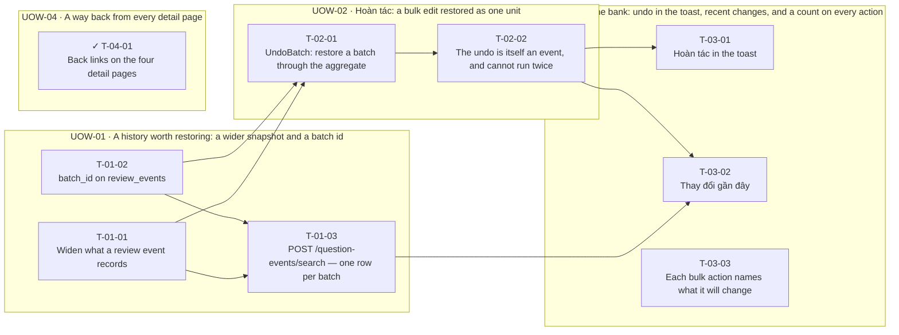

<!-- GENERATED by scripts/uow_graph.py — do not edit by hand -->

# Ticket graph — 2026092305-bulk-safety

- Units of Work: **4**
- Tickets: **9** (1 done)
- Total effort: **3.4d**
- Critical path: **1.8d** across 4 tickets
- Theoretical minimum duration with unlimited parallelism: **1.8d**

## Units of Work

| UoW | Title | Risk | Effort | Elapsed | Depends on | Status |
|-----|-------|------|--------|---------|-----------|--------|
| UOW-01 | A history worth restoring: a wider snapshot and a batch id | medium | 1.1d | 7h | — | todo |
| UOW-02 | Hoàn tác: a bulk edit restored as one unit | medium | 7h | 7h | — | todo |
| UOW-03 | The bank: undo in the toast, recent changes, and a count on every action | low | 1.1d | 4h | — | todo |
| UOW-04 | A way back from every detail page | low | 2h | 2h | — | todo |

Effort is total person-hours. Elapsed is the longest dependency chain inside the
slice — the floor on how fast it can finish no matter how many people work on it.

## Dependency graph

## Execution waves

Tickets in the same wave have no dependency between them and can run in parallel.

| Wave | Tickets | Parallel capacity | Wave duration (longest ticket) |
|------|---------|-------------------|-------------------------------|
| W1 | T-01-01, T-01-02, T-03-03, T-04-01 | 4 | 3h |
| W2 | T-01-03, T-02-01 | 2 | 4h |
| W3 | T-02-02 | 1 | 3h |
| W4 | T-03-01, T-03-02 | 2 | 4h |

## Write-conflict hazards

These pairs have no ordering constraint, so a scheduler may run them at the
same time — and they write the same path. Sequential execution is safe;
parallel agents will lose one side's work.

| A | B | Contested path |
|---|---|---|
| T-01-03 | T-02-02 | `apps/api/app/modules/bank/interface/router.py`, `apps/api/app/modules/bank/interface/schemas.py` |

## Critical path

T-01-01 → T-02-01 → T-02-02 → T-03-02

Total: **1.8d**. Shortening the plan means shortening this chain;
adding people to tickets off this path will not make the feature ship sooner.

## Tickets

| ID | UoW | Layer | Type | Est | Depends on | Verifies | Status |
|----|-----|-------|------|-----|-----------|----------|--------|
| T-01-01 | UOW-01 | domain | feature | 3h | — | AC-01 | in_progress |
| T-01-02 | UOW-01 | data | feature | 2h | — | AC-03 | todo |
| T-01-03 | UOW-01 | api | feature | 4h | T-01-01, T-01-02 | AC-03, AC-05 | todo |
| T-02-01 | UOW-02 | api | feature | 4h | T-01-01, T-01-02 | AC-01, AC-02 | todo |
| T-02-02 | UOW-02 | api | feature | 3h | T-02-01 | AC-04, AC-05 | todo |
| T-03-01 | UOW-03 | web | feature | 3h | T-02-02 | AC-01 | todo |
| T-03-02 | UOW-03 | web | feature | 4h | T-01-03, T-02-02 | AC-03, AC-04, AC-05 | todo |
| T-03-03 | UOW-03 | web | feature | 2h | — | AC-06 | todo |
| T-04-01 | UOW-04 | web | feature | 2h | — | AC-07 | done |
