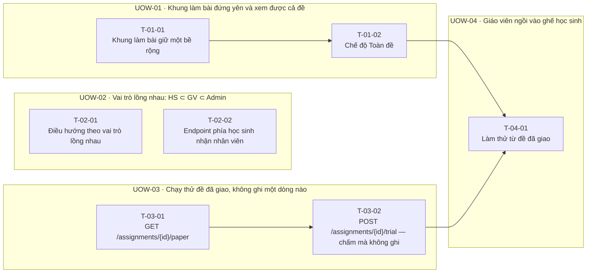

<!-- GENERATED by scripts/uow_graph.py — do not edit by hand -->

# Ticket graph — 2026092402-exam-runner-and-roles

- Units of Work: **4**
- Tickets: **7** (0 done)
- Total effort: **2.8d**
- Critical path: **1.4d** across 3 tickets
- Theoretical minimum duration with unlimited parallelism: **1.4d**

## Units of Work

| UoW | Title | Risk | Effort | Elapsed | Depends on | Status |
|-----|-------|------|--------|---------|-----------|--------|
| UOW-01 | Khung làm bài đứng yên và xem được cả đề | low | 6h | 6h | — | todo |
| UOW-02 | Vai trò lồng nhau: HS ⊂ GV ⊂ Admin | medium | 5h | 3h | — | todo |
| UOW-03 | Chạy thử đề đã giao, không ghi một dòng nào | medium | 7h | 7h | — | todo |
| UOW-04 | Giáo viên ngồi vào ghế học sinh | low | 4h | 4h | — | todo |

Effort is total person-hours. Elapsed is the longest dependency chain inside the
slice — the floor on how fast it can finish no matter how many people work on it.

## Dependency graph

## Execution waves

Tickets in the same wave have no dependency between them and can run in parallel.

| Wave | Tickets | Parallel capacity | Wave duration (longest ticket) |
|------|---------|-------------------|-------------------------------|
| W1 | T-01-01, T-02-01, T-02-02, T-03-01 | 4 | 3h |
| W2 | T-01-02, T-03-02 | 2 | 4h |
| W3 | T-04-01 | 1 | 4h |

## Write-conflict hazards

None: every pair that writes a shared path is ordered by a dependency.

## Critical path

T-03-01 → T-03-02 → T-04-01

Total: **1.4d**. Shortening the plan means shortening this chain;
adding people to tickets off this path will not make the feature ship sooner.

## Tickets

| ID | UoW | Layer | Type | Est | Depends on | Verifies | Status |
|----|-----|-------|------|-----|-----------|----------|--------|
| T-01-01 | UOW-01 | web | feature | 2h | — | AC-01 | todo |
| T-01-02 | UOW-01 | web | feature | 4h | T-01-01 | AC-02, AC-03 | todo |
| T-02-01 | UOW-02 | web | feature | 2h | — | AC-06 | todo |
| T-02-02 | UOW-02 | api | feature | 3h | — | AC-07 | todo |
| T-03-01 | UOW-03 | api | feature | 3h | — | AC-04 | todo |
| T-03-02 | UOW-03 | api | feature | 4h | T-03-01 | AC-05 | todo |
| T-04-01 | UOW-04 | web | feature | 4h | T-01-02, T-03-02 | AC-04, AC-05 | todo |
