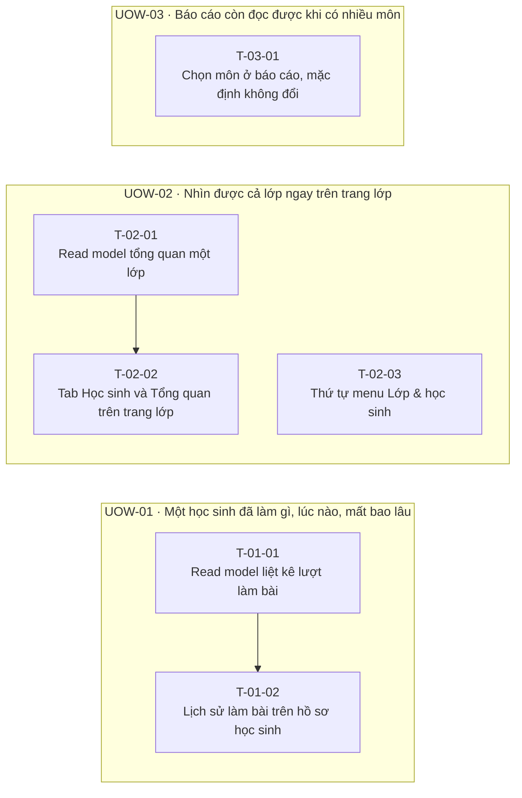

<!-- GENERATED by scripts/uow_graph.py — do not edit by hand -->

# Ticket graph — 2026092501-class-overview-and-subjects

- Units of Work: **3**
- Tickets: **6** (0 done)
- Total effort: **2.5d**
- Critical path: **1.0d** across 2 tickets
- Theoretical minimum duration with unlimited parallelism: **1.0d**

## Units of Work

| UoW | Title | Risk | Effort | Elapsed | Depends on | Status |
|-----|-------|------|--------|---------|-----------|--------|
| UOW-01 | Một học sinh đã làm gì, lúc nào, mất bao lâu | low | 7h | 7h | — | todo |
| UOW-02 | Nhìn được cả lớp ngay trên trang lớp | low | 1.1d | 1.0d | — | todo |
| UOW-03 | Báo cáo còn đọc được khi có nhiều môn | low | 4h | 4h | — | todo |

Effort is total person-hours. Elapsed is the longest dependency chain inside the
slice — the floor on how fast it can finish no matter how many people work on it.

## Dependency graph

## Execution waves

Tickets in the same wave have no dependency between them and can run in parallel.

| Wave | Tickets | Parallel capacity | Wave duration (longest ticket) |
|------|---------|-------------------|-------------------------------|
| W1 | T-01-01, T-02-01, T-02-03, T-03-01 | 4 | 4h |
| W2 | T-01-02, T-02-02 | 2 | 4h |

## Write-conflict hazards

None: every pair that writes a shared path is ordered by a dependency.

## Critical path

T-02-01 → T-02-02

Total: **1.0d**. Shortening the plan means shortening this chain;
adding people to tickets off this path will not make the feature ship sooner.

## Tickets

| ID | UoW | Layer | Type | Est | Depends on | Verifies | Status |
|----|-----|-------|------|-----|-----------|----------|--------|
| T-01-01 | UOW-01 | api | feature | 4h | — | AC-01, AC-02 | todo |
| T-01-02 | UOW-01 | web | feature | 3h | T-01-01 | AC-01, AC-02 | todo |
| T-02-01 | UOW-02 | api | feature | 4h | — | AC-03, AC-04 | todo |
| T-02-02 | UOW-02 | web | feature | 4h | T-02-01 | AC-03, AC-04 | todo |
| T-02-03 | UOW-02 | web | chore | 1h | — | AC-07 | todo |
| T-03-01 | UOW-03 | web | feature | 4h | — | AC-05, AC-06 | todo |
