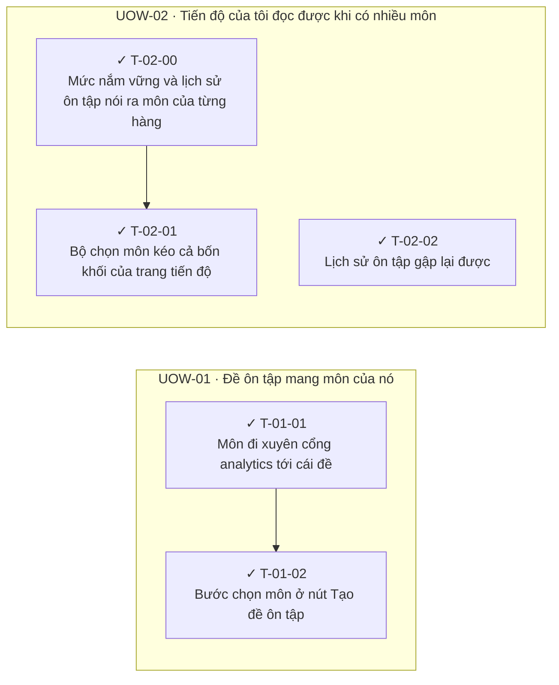

<!-- GENERATED by scripts/uow_graph.py — do not edit by hand -->

# Ticket graph — 2026092602-student-side-subjects

- Units of Work: **2**
- Tickets: **5** (5 done)
- Total effort: **1.9d**
- Critical path: **7h** across 2 tickets
- Theoretical minimum duration with unlimited parallelism: **7h**

## Units of Work

| UoW | Title | Risk | Effort | Elapsed | Depends on | Status |
|-----|-------|------|--------|---------|-----------|--------|
| UOW-01 | Đề ôn tập mang môn của nó | low | 6h | 6h | — | todo |
| UOW-02 | Tiến độ của tôi đọc được khi có nhiều môn | low | 1.1d | 7h | — | todo |

Effort is total person-hours. Elapsed is the longest dependency chain inside the
slice — the floor on how fast it can finish no matter how many people work on it.

## Dependency graph

## Execution waves

Tickets in the same wave have no dependency between them and can run in parallel.

| Wave | Tickets | Parallel capacity | Wave duration (longest ticket) |
|------|---------|-------------------|-------------------------------|
| W1 | T-01-01, T-02-00, T-02-02 | 3 | 3h |
| W2 | T-01-02, T-02-01 | 2 | 4h |

## Write-conflict hazards

These pairs have no ordering constraint, so a scheduler may run them at the
same time — and they write the same path. Sequential execution is safe;
parallel agents will lose one side's work.

| A | B | Contested path |
|---|---|---|
| T-01-01 | T-02-00 | `apps/api/app/modules/analytics/infrastructure/adapters/assessment.py` |
| T-01-02 | T-02-01 | `apps/web/src/components/page-components/MyStats/MyStatsPage.tsx`, `apps/web/src/hooks/page-hooks/my-stats/use-my-stats-page.ts` |

## Critical path

T-02-00 → T-02-01

Total: **7h**. Shortening the plan means shortening this chain;
adding people to tickets off this path will not make the feature ship sooner.

## Tickets

| ID | UoW | Layer | Type | Est | Depends on | Verifies | Status |
|----|-----|-------|------|-----|-----------|----------|--------|
| T-01-01 | UOW-01 | api | feature | 3h | — | AC-03 | done |
| T-01-02 | UOW-01 | web | feature | 3h | T-01-01 | AC-01, AC-02 | done |
| T-02-00 | UOW-02 | api | feature | 3h | — | AC-05, AC-07 | done |
| T-02-01 | UOW-02 | web | feature | 4h | T-02-00 | AC-04, AC-05 | done |
| T-02-02 | UOW-02 | web | feature | 2h | — | AC-06, AC-07 | done |
